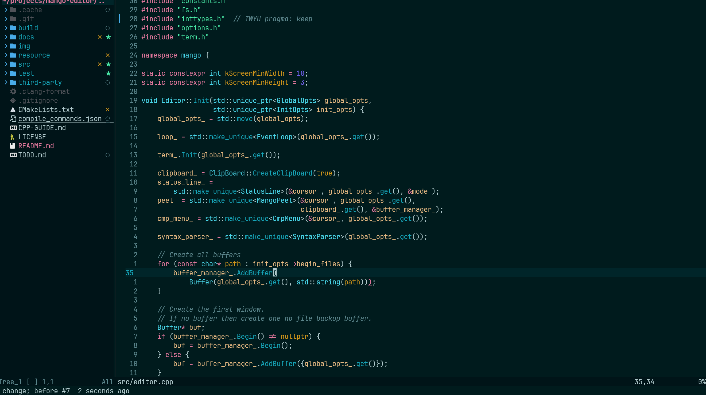

# Noctis for Neovim

A collection of balanced light & dark themes for Neovim, ported from the [Noctis VSCode theme](https://github.com/liviuschera/noctis).

Noctis features a well-balanced blend of warm and cold colors that are carefully designed to be easy on the eyes.

## NOTE

This repo is generated by LLM!!!! Just for fun and best effort usable. Any 💩 pr is welcome.

## Screenshots

Noctis Sereno



## 🎨 Available Themes

### Light Themes
- **noctis-lux** - Clean light theme
- **noctis-hibernus** - Soft light theme
- **noctis-lilac** - Purple-tinted light theme

### Dark Themes
- **noctis** - Classic dark theme
- **noctis-vscode** - Dark theme with VSCode-like background
- **noctis-azureus** - Blue-tinted dark theme
- **noctis-bordo** - Burgundy-tinted dark theme
- **noctis-obscuro** - Deep dark theme
- **noctis-sereno** - Calm dark theme
- **noctis-uva** - Purple-tinted dark theme
- **noctis-viola** - Violet-tinted dark theme
- **noctis-minimus** - Minimalist dark theme

## 📦 Installation

### Using [lazy.nvim](https://github.com/folke/lazy.nvim)

```lua
{
  "Old-Farmer/noctis-nvim",
  lazy = false,
  priority = 1000,
}
```

### Using vim-plug

```vim
Plug 'Old-Farmer/noctis-nvim'
```

### Using vim.pack

```lua
vim.pack.add({ "https://github.com/Old-Farmer/noctis-nvim" })
```

## 🚀 Usage

Configure and load theme:

```lua
-- Default setup
require("noctis").setup({
  theme = "noctis", -- Options: noctis, lux, hibernus, lilac, minimus, azureus, bordo, obscuro, sereno, uva, viola
  integrations = {
    -- All integrations are enabled by default
    telescope = true,
    ["fzf-lua"] = true,
    ["nvim-tree"] = true,
    ["neo-tree"] = true,
    gitsigns = true,
    ["indent-blankline"] = true,
    ["which-key"] = true,
    lualine = true,
    alpha = true,
    notify = true,
  }
})

-- Load the theme
vim.cmd([[colorscheme noctis]])
```

Or simply use colorscheme command without setup:

```lua
vim.cmd([[colorscheme noctis]])
```

## 🎯 Features

- ✅ Full Treesitter support
- ✅ LSP semantic highlighting
- ✅ Popular plugin support:
  - Telescope
  - fzf-lua
  - NvimTree / Neo-tree
  - GitSigns
  - Indent Blankline
  - Lualine
  - Which-key
  - And more!

## 📝 Credits

Original theme by [Liviu Schera](https://github.com/liviuschera/noctis) for Visual Studio Code.
Ported to Neovim with love.

## 📄 License

MIT
